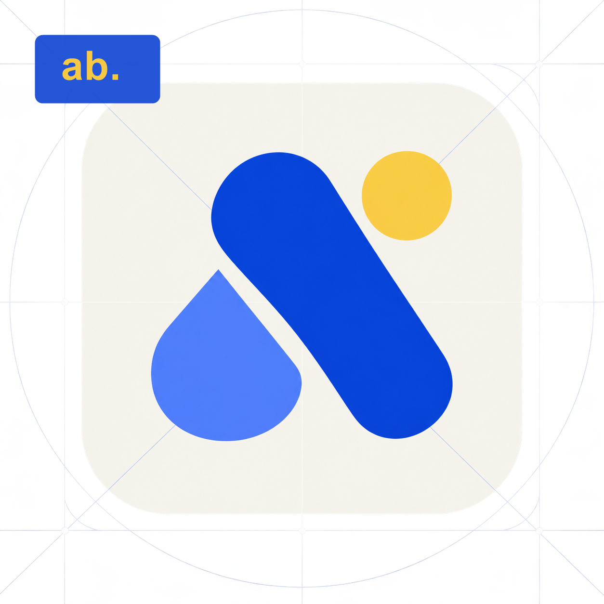
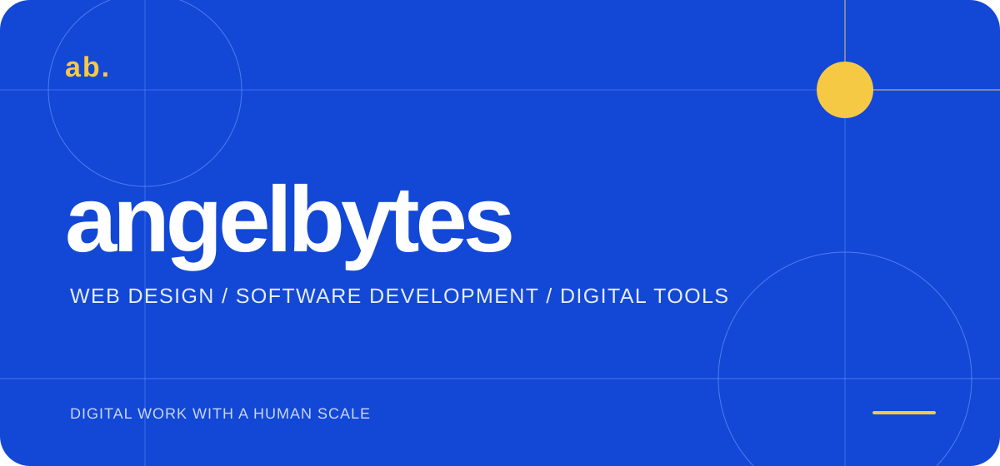
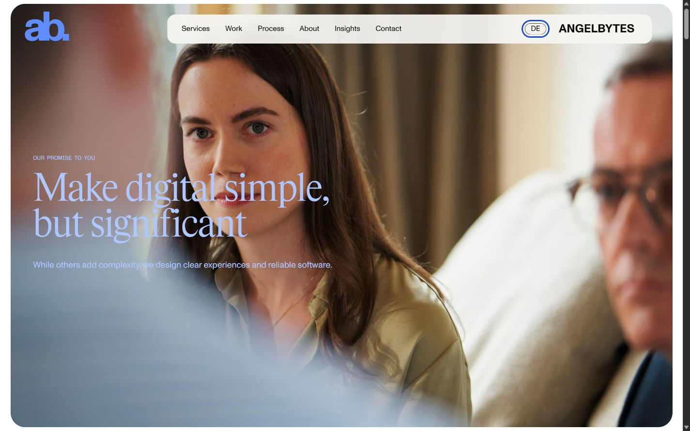

  

  

  
  
  

# Angelbytes

<strong>Digital products, websites, and software built with clarity.</strong>

Angelbytes is a small web design and software development studio for people
who need digital work to be clear, useful, and dependable. We design and build
websites, Windows desktop applications, and practical tools that turn complex
work into a calmer experience.

**[Website](https://angelbytes.de/)** · **[What we build](#what-we-build)** ·
**[How we work](#how-we-work)** · **[Current focus](#current-focus)** ·
**[Contact](#start-a-conversation)**

## What we build

### 01 — Web design

Responsive marketing sites and product interfaces with a clear visual system,
strong content hierarchy, and accessible interactions.

### 02 — Software development

Focused applications with maintainable architecture, secure defaults, and a
quality bar that survives handoff.

### 03 — Digital workflows

Lightweight tools that reduce repetitive work and help small teams make better
decisions without adding operational noise.

## How we work

<table>
  <tr>
    <td width="33%" valign="top"><strong>Purpose</strong>  Every screen, endpoint, and automation has a reason to exist. We start with the user outcome.</td>
    <td width="33%" valign="top"><strong>Craft</strong>  Typography, responsive behavior, keyboard access, error states, performance, and documentation are part of the product.</td>
    <td width="33%" valign="top"><strong>Responsibility</strong>  We prefer transparent scope, privacy-aware defaults, recoverable actions, and honest communication.</td>
  </tr>
</table>

## Selected work

<a href="https://angelbytes.de/">Explore the Angelbytes website and current work</a>

## Current focus

### Angelbyte Desk

Angelbyte Desk is our current Windows workspace for structured lead research
and outreach preparation. It is being designed with a deliberate review step
before any external message is sent, so speed never replaces judgment.

The planned stack is Tauri, Rust, TypeScript, React, and SQLite. The product is
in progress and is not presented as a released customer tool yet.

## Quality bar

- Accessible hierarchy, keyboard support, readable contrast, and reduced-motion
  behavior where an interface needs motion.
- Repeatable tests and production builds from documented commands.
- Secure handling of contact data and secrets; credentials never belong in a
  repository or README.
- Clear limitations and a useful handoff for the next person who maintains the
  work.

## Start a conversation

Tell us what you are trying to make, improve, or untangle. We will respond with
the next practical step rather than a generic sales pitch.

- Website: [angelbytes.de](https://angelbytes.de/)
- Email: [kontakt@angelbytes.de](mailto:kontakt@angelbytes.de)
- GitHub: [Angelbytesde](https://github.com/Angelbytesde)

  <code>ab.</code> Angelbytes · digital work with a human scale · 2026

